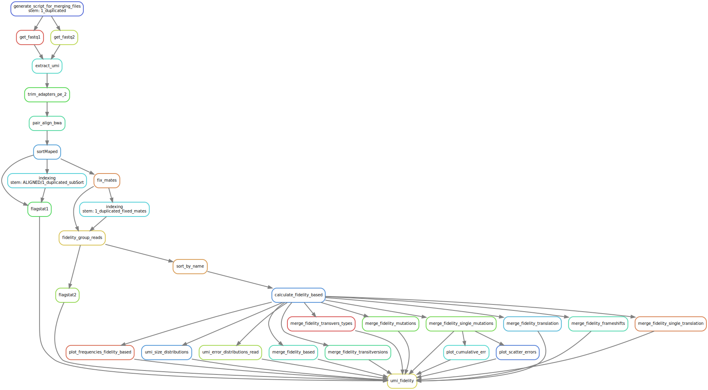

# MuA-based Molecular Indexing for Rare Mutation Detection by Next-Generation Sequencing

## Description

This code was used to generate [MuA-based Molecular Indexing for Rare Mutation Detection by Next-Generation Sequencing]("") publication data.
Workflow is designed to evaluate and calculate true errors based on either on Unique Molecular Identifier (UMI) or mapping duplicates clusters.
This workflow is written in [snakemake](https://github.com/snakemake/snakemake) workflow manager.
Error calculation package is written in [julia](https://github.com/JuliaLang/Julia) programming language.
Workflow also uses:

1. [umi-tools](https://github.com/CGATOxford/UMI-tools) to extract and process UMI sequence information.

1. [bwa-mem](https://github.com/lh3/bwa) algorithm for short pair end reads alignment to the reference.

1. [sambamba](https://github.com/biod/sambamba) and [samtools](https://github.com/samtools/samtools) for aligned data sorting and filtering respectively.

DAG of a UMI-based errors calculation workflow rules:


## Workflow setup

1. Install `conda`:

    ```bash
    wget -P miniconda https://repo.continuum.io/miniconda/Miniconda3-latest-Linux-x86_64.sh &&
    chmod 755 ./miniconda/Miniconda3-latest-Linux-x86_64.sh &&
    ./miniconda/Miniconda3-latest-Linux-x86_64.sh
    ```

1. Add path of `miniconda` to `.bashrc` if not selected option to add automatically during installation:

    ```bash
    cd ~/ && pth=$(pwd) &&
    echo "PATH=$PATH:$pth/miniconda3/bin" >> ~/.bashrc
    ```

1. Add channels to `conda`:

    ```bash
    conda config --add channels conda-forge
    conda config --add channels bioconda
    conda config --add channels anaconda
    ```

1. Install all by running:

    ```bash
    bash envs/install_all.sh -n <environment_name>
    ```

1. To delete environment run:

    ```bash
    conda env remove -n <environment_name> -p <environment_path>
    ```

## Usage

1. To run custom analysis first configure `config.yam` file.

1. Activate created environment:

    ```bash
    source activate <environment_name>
    ```

1. Run `snakemake`:

    ```bash
    snakemake -j 24 --configfile config.yaml --use-conda
    ```

    > You can provide rule names for snakemake command as follows:
    > snakemake --configfile config.yaml --use-conda -j 24 __trim__ __download__ __umi_fidelity__

## Testing

1. To run all tests:

    ```bash
    bash tests/run_tests.sh --all --name test_env
    ```

    > New conda env will be created and after tests removed.

1. For further options check help:

    ```bash
    bash tests/run_tests.sh --help
    ```

## Configuration file explained

Workflow checks if __must have__ parameters were provided. All other if not provided will be used from `defaul.yaml` file.
Thus your config file must contain at least these parameters:

```yaml
MAIN:
    INPUT_DIR:
    SAMPLES_ID:
    TMP_DIR:
    OUT_DIR:
    LANE_R:
    REFERENCE:
```

### Configuration file in details

1. Provide an existing path to your sequencing data.

    ```yaml
    MAIN:
        INPUT_DIR: /some/dir/to/seq/data
    ```

1. For workflow to be able to find your sample sequencig files provide prefix / sample name of sequencing file you want to analyse.

    ```yaml
    MAIN:
        SAMPLES_ID: sample_1 sample_2  # sample_1_S1_L001_R1_001.fastq.gz
    ```

    > Omit Illumina sequencing file naming suffix. Workflow searches for either *fastq.gz, *fq.gz or *.sfq files.

1. Provide regex to be able to find files split by lanes:

    ```yaml
    MAIN:
        LANE_RE: "L\\d\\d\\d_"  # This would translate to L001 lane number for example.
    ```

    > Illumina sequencing might split data by separate lanes. It is usually 'L\\d' or 'L\\d\\d\\d' where '\\d' is an integer.
    > All files which do match sample id, lane, and read direction will be mergeg to generate single sequencing file which is not split by lanes.

1. Default trimming program is `bbduk`. All parameter names listed in configuration file are exactly the same as it would be calling it from CLI.

1. To extract UMI from raw reads data you need to provide UMI sequence structure:

    ```yaml
    UMI_TOOLS:
        umi_structure: NNNNNNNNNNNNNNNN
    ```

    To extract UMI from the second paired-end read you need to pass --bc-pattern2 parameter for `umi-tools`

    ```yaml
    UMI_TOOLS:
        additional_extract_params: " --bc-pattern2=NNNNNNNNNNNNNNNN "
    ```

    > You can also pass other `umi-tools` supported options here as a tring separated by spaces.

1. Available parameters for error calculations:

    ```yaml
    FIDELITY:
    ```

    1. Filter reads by alignment quality:

        ```yaml
        alignment_quality: 60
        ```

    1. Filter bases by base quality:

        ```yaml
        base_quality: 30          # min quality for mutation to be considered in read. [30]
        ```

    1. Define minimum cluster size (cluster smaller in size will be discarded from the further analysis):

        ```yaml
        cluster_size: 3
        ```

        > If `naive` algorithm is selected then this filter option is omitted.
        > Cluster in this case is defined either by umi sequences + mapping position (`umi` algorithm)
        > or just mapping position (`position` algorithm)

    1. Setting allowed maximum number of errors detected in read:

        ```yaml
        max_mutations_per_read: 3
        ```

    1. If __true__  error is found between many clusters it might indicate that reference sequence is not correct. To omit such errors provide upper threshold:

        ```yaml
        referece_mutation: 0.95   # how many same mutations at position to consider as reference mistake.
        ```

        > If same error was found in 95% of umi cluster cases, consider it as a reference assembly mistake.

    1. These two options should not be chaged if using umi-tools for UMI sequences extraction and grouping:

        ```yaml
        umi_split_string: "_"
        umi_split_position: 2     # position of umi after spliting readname by umi string. 1 based.
        ```

    1. You can translate nucleotide mutations by providing these parameters:

        ```yaml
        genes_csv: Some_File.csv
        genetic_code: 11
        ```

        > In that case you need to pass a csv file with 'Chromosome,Start,End,Gene,Strand'. Coordinates are one based and inclusive.
        > With a third option you can tell which table to use for translation (BioSequences.ncbi_trans_table).

    1. You can also pass additional script parameters:

        ```yaml
        additional_params: "--algorithm umi"
        ```

        > Supported algorithms: naive, position, umi, paired.
        > More can be check with CLI --help option.

    1. To report mutations provide:

        ```yaml
        report_mutations: True
        ```

        > All found mutations will be reported to a csv file.

    1. You can also apply additional filtering on mutations reporting:

        ```yaml
        min_cluster_counts: 1     # Minimum count of clusters for the mutation to be reported to a single_mutations file.
        min_mutation_coverage: 1  # Minimum confident coverage for the mutation to be reported to a single_mutations file.
        ```
